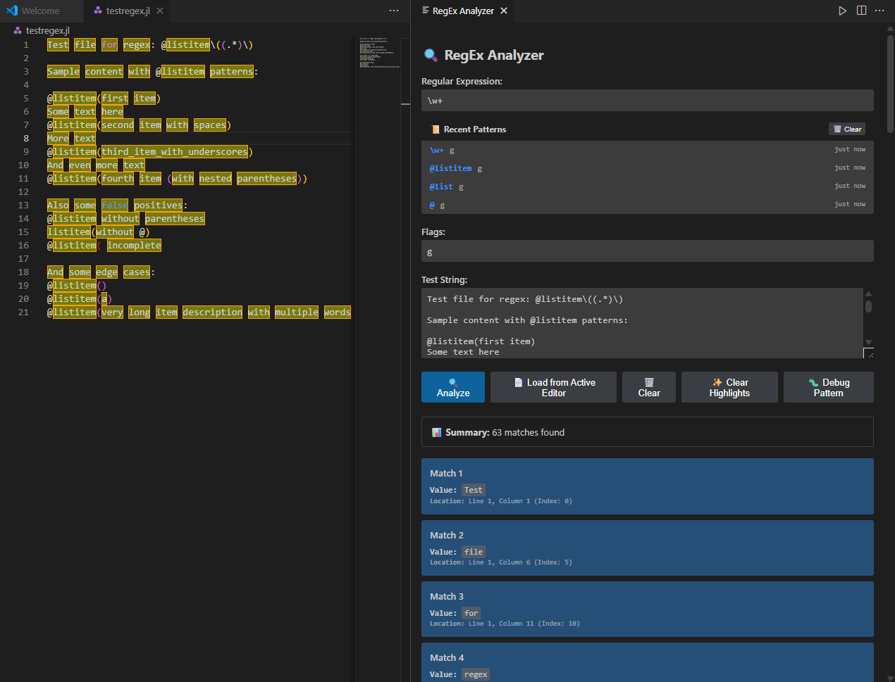
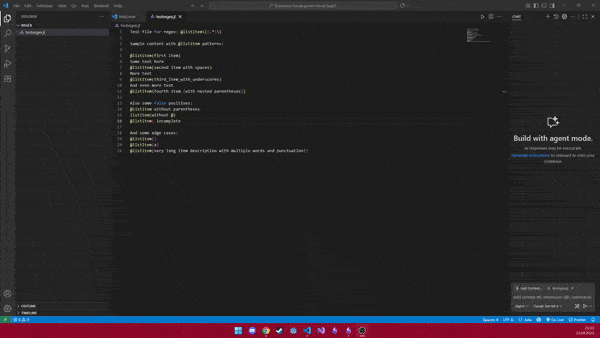

# RegEx Tester for VSCode

A powerful Visual Studio Code extension for testing regular expressions directly in your editor. No more switching between VSCode and external regex testing websites!

## ✨ Features

### 🔍 **Interactive Regex Analyzer** (NEW!)
- **Modern Webview Interface**: Dedicated panel for comprehensive regex testing
- **Auto-load Editor Text**: Automatically loads text from your active editor
- **Real-time Updates**: Matches update instantly as you type your regex
- **Live Validation**: Visual feedback shows if your regex is valid while typing
- **Smart Debouncing**: Optimized update speeds for different input types

### 🎯 **Advanced Highlighting**
- **Real-time Editor Highlighting**: Matches are highlighted directly in your editor
- **Multi-group Support**: Different colors for regex groups
- **Persistent Highlighting**: Works even when webview has focus
- **Smart Clearing**: Automatically clears highlights when regex is empty

### 📊 **Detailed Match Information**
- **Line & Column Numbers**: Precise location of each match
- **Group Analysis**: Shows all captured groups with their values
- **Match Statistics**: Summary of total matches found
- **Context Preview**: Shows surrounding text for each match

### 🚀 **Quick Actions**
- **Command Palette**: Access via "Regex Analyzer: Show"
- **Context Menu**: Right-click selected text → "Find RegEx from selection"
- **Keyboard Shortcut**: `Ctrl+Shift+Alt+R`
- **Editor Button**: Click the regex icon in the editor tab

## 🎮 How to Use

### Method 1: Interactive Analyzer (Recommended)
1. Open a file in VSCode
2. Open Command Palette (`Ctrl+Shift+P`)
3. Type "Regex Analyzer: Show"
4. The analyzer automatically loads your editor text
5. Type your regex and see instant results!

### Method 2: Quick Regex Test
1. Select text in your editor (optional)
2. Press `Ctrl+Shift+Alt+R` or click the regex icon
3. Enter your regex pattern and flags
4. View matches in the output panel

### Method 3: From Selection
1. Select a regex pattern in your editor
2. Right-click → "Find RegEx from selection"
3. Test the selected regex instantly

## 🎨 Visual Features

- **Color-coded Groups**: Each regex group gets a unique color
- **Hover Information**: Detailed match info on hover
- **Loading Indicators**: See when analysis is in progress
- **Error Feedback**: Clear error messages for invalid regex

## ⚙️ Technical Details

- **Performance Optimized**: Intelligent debouncing prevents excessive processing
- **Memory Efficient**: Proper cleanup of decorations and resources
- **Cross-platform**: Works on Windows, macOS, and Linux
- **VS Code API**: Uses native VS Code decoration and webview APIs

## 🐛 Known Issues

- **Theme Compatibility**: Highlighting colors may affect readability on some dark themes
- **Large Files**: Performance may decrease with very large files (>1MB)
- **Complex Regex**: Very complex patterns may take longer to process

## 📝 Release Notes

### 🎉 0.4.0 (Latest)
**Major Update: Interactive Analyzer & Real-time Features**

- ✨ **NEW**: Interactive Webview-based Regex Analyzer
- ✨ **NEW**: Auto-update matches while typing regex (300ms debounce)
- ✨ **NEW**: Live regex validation with visual feedback
- ✨ **NEW**: Real-time editor highlighting even when webview has focus
- ✨ **NEW**: Auto-load editor text into analyzer
- ✨ **NEW**: Loading indicators and improved UX
- 🔧 **IMPROVED**: Better error handling and debugging
- 🔧 **IMPROVED**: Modular architecture with separate highlighting system
- 🔧 **IMPROVED**: Performance optimizations with intelligent debouncing

### 0.3.2
- ✨ **NEW**: Line and column numbers in match results
- 🔧 **IMPROVED**: Enhanced match information display

### 0.3.1
- ✨ **NEW**: Context menu option "Find RegEx from selection"
- 🔧 **IMPROVED**: Better integration with editor workflow

### 0.3.0
- ✨ **NEW**: Editor icon for quick access
- ✨ **NEW**: Keyboard shortcut (`Ctrl+Alt+Shift+R`)
- 🔧 **IMPROVED**: UI/UX enhancements

### 0.1.5
- ✨ **NEW**: RegEx flags support (g, i, m, s, u, y)

### 0.1.0
- 🎉 **Initial Release**: Basic regex testing functionality

## 🤝 Contributing

This extension was created with the help of GitHub Copilot and continues to evolve based on user feedback. Feel free to submit issues and feature requests!

## 📄 License

MIT License - see [LICENSE](LICENSE) file for details.

---

**Enjoy testing your regular expressions without leaving VSCode!** 🚀

